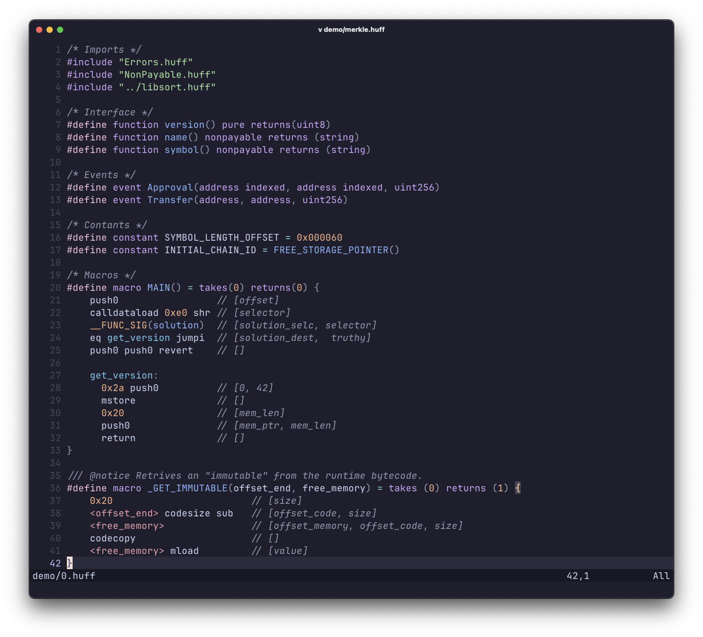

# ♟️ huff.nvim

> **Neovim Treesitter integration for the [Huff language](https://docs.huff.sh/)**

[](https://neovim.io)
[](https://tree-sitter.github.io/tree-sitter/)
[](LICENSE)
[](https://github.com/mmsaki/huff.nvim/releases)

`huff.nvim` is a lightweight Neovim plugin that brings **Treesitter-powered syntax highlighting** and **indentation support** for the [Huff](https://docs.huff.sh/) low-level EVM language.

## ✨ Features

* 🧩 **Treesitter-powered parsing** — accurate syntax highlighting
* 📜 **Huff language support** — adds `.huff` filetpye and registers in nvim-treesitter
* 🔍 **Opcode lookup** — hover over opcodes to see descriptions, inputs, and outputs
* 🛠️ **Simple setup** - no extra configuration needed tree-sitter-huff is auto installed
* ⚡️ **Huff Neo** - Supports [Huff Neo](https://github.com/cakevm/huff-neo) compiler buildins



## 📦 Installation

Using **[lazy.nvim](https://github.com/folke/lazy.nvim)**:

```lua
return {
  "mmsaki/huff.nvim",
  version = "0.2.*",
  dependencies = { "nvim-treesitter/nvim-treesitter" },
  opts = {
    window_type = "floating", -- "floating" or "split"
  },
}
```

## ⚙️ Configuration

The plugin can be configured with the following options:

| Option        | Type   | Default      | Description |
| ------------- | ------ | ------------ | ----------- |
| `window_type` | string | `"floating"` | Display mode for opcode information: `"floating"` for floating window or `"split"` for horizontal split at top |

## ⚒️ Commands

| Command                         | Description              |
| ------------------------------- | ------------------------ |
| `:TSInstall huff`               | Installs the Huff parser |
| `:TSUpdateSync huff`            | Updates huff parsers     |
| `:OpcodeInfo [opcode]`          | Look up EVM opcode       |
| <kbd>shift</kbd> → <kbd>k</kbd> | Opcode Lookup            |

Supports all EVM opcodes including arithmetic, comparison, bitwise, memory, storage, and control flow operations.

## 🔄 Alternatives

While there are other Huff plugins available, `huff.nvim` offers several advantages:

| Feature | huff.nvim | [wuwe1/vim-huff](https://github.com/wuwe1/vim-huff) | [pedrommaiaa/vim-huff](https://github.com/pedrommaiaa/vim-huff) |
| ----------------------- | - | - | - |
| **Syntax Highlighting** | ✓ | ✓ | ✓ |
| **Indentation**         | ✓ | ✓ | ✓ |
| **Opcode Lookup**       | ✓ | ✓ | x |
| **Grammar Parsing**     | ✓ | x | x |
| **TreeSitter Support**  | ✓ | x | x |

> Thanks for wuwe1's plugin for inspiring the opcodes lookup feature

## 🤝 Contributing

Contributions are welcome!
If you’d like to improve the parser, fix bugs, or add features, open an **issue** or submit a **PR**.

## 📜 License

[MIT](LICENSE) © 2025 [mmsaki](https://github.com/mmsaki)
