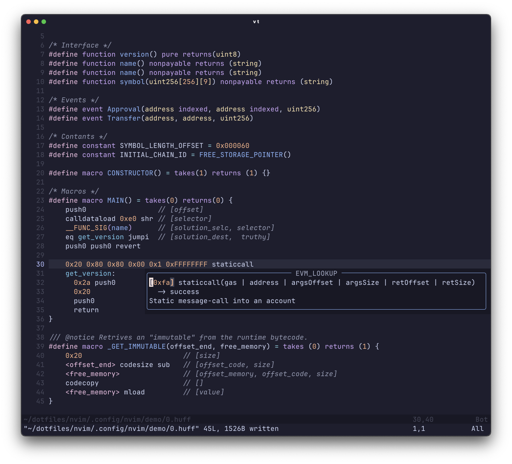

# ♟️ huff.nvim

> **Neovim Treesitter integration for the [Huff language](https://docs.huff.sh/)**

[](https://neovim.io)
[](https://tree-sitter.github.io/tree-sitter/)
[](LICENSE)

`huff.nvim` is a lightweight Neovim plugin that brings **Treesitter-powered syntax highlighting** and **indentation support** for the [Huff](https://docs.huff.sh/) low-level EVM language.

## ✨ Features

* 🧩 **Treesitter-powered parsing** — accurate syntax highlighting
* 📜 **Huff language support** — compatible with `.huff` files
* 🔍 **Opcode lookup** — hover over opcodes to see descriptions, inputs, and outputs
* ⚡ **Lazy-loaded** for performance
* 🛠️ Simple setup, no extra configuration needed



## 📦 Installation

Using **[lazy.nvim](https://github.com/folke/lazy.nvim)**:

```lua
return {
  "mmsaki/huff.nvim",
  version = "0.2.*",
  dependencies = { "nvim-treesitter/nvim-treesitter" },
}
```

## ⚒️ Commands

| Command           | Description              |
| ----------------- | ------------------------ |
| `:TSInstall huff` | Installs the Huff parser |
| `:TSUpdate`       | Updates all parsers      |
| `:OpcodeInfo`     | Look up EVM opcode information |
| <kbd>shift</kbd> → <kbd>k</kbd> | Opcode Lookup |

Supports all EVM opcodes including arithmetic, comparison, bitwise, memory, storage, and control flow operations.

## 🔄 Alternatives

While there are other Huff plugins available, `huff.nvim` offers several advantages:

| Feature | huff.nvim | [wuwe1/vim-huff](https://github.com/wuwe1/vim-huff) | [pedrommaiaa/vim-huff](https://github.com/pedrommaiaa/vim-huff) |
| --- | --- | --- | --- |
| **Syntax Highlighting** | ✓ | ✓ | ✓ |
| **Indentation** | ✓ | ✓ | ✓ |
| **Opcode Lookup** | ✓ | ✓ | x |
| **Grammar Parsing** | ✓ | x | x |
| **TreeSitter Support** | ✓ | x | x |

## 🤝 Contributing

Contributions are welcome!
If you’d like to improve the parser, fix bugs, or add features, open an **issue** or submit a **PR**.

## 📜 License

[MIT](LICENSE) © 2025 [mmsaki](https://github.com/mmsaki)
